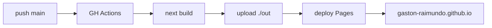

<div align="center">

# Gastón Raimundo · Sitio institucional

**Diseño ecosistemas de datos para áreas productivas y administrativas** — integrando reportes, automatizaciones y dashboards en una capa única, escalable hacia BI e Industria 4.0 por fases.

[](https://nextjs.org)
[](https://react.dev)
[](https://www.typescriptlang.org)
[](https://tailwindcss.com)
[](https://gaston-raimundo.github.io)

**[Ver sitio en vivo →](https://gaston-raimundo.github.io)**

</div>

---

## Sobre el proyecto

Sitio personal de consultoría construido como una aplicación Next.js con export estático a GitHub Pages. El sitio comunica un enfoque consultivo por fases validables (Saneamiento → Automatización → Industria 4.0) y funciona como punto de entrada para clientes que buscan profesionalizar su operación de datos.

No hay backend, ni tracking, ni dependencias externas más allá de Google Fonts y un embed de YouTube. Todo el contenido vive en el repositorio como código.

## Stack

| Capa | Tecnología |
|---|---|
| Framework | Next.js 15 (App Router, static export) |
| UI | React 19 + TypeScript 5 |
| Estilos | Tailwind CSS 3 con paleta custom (primary · industrial · accent) |
| Fuentes | Inter + JetBrains Mono (Google Fonts) |
| Build / Deploy | GitHub Actions → GitHub Pages |
| Hosting | GitHub Pages (dominio `gaston-raimundo.github.io`) |

## Estructura

```
institutional-web/
├── app/
│   ├── components/            # Componentes de sección
│   │   ├── Navbar.tsx         # Header con navegación anchor + CTA
│   │   ├── Hero.tsx           # Headline + modal video YouTube 1080p
│   │   ├── Servicios.tsx      # 3 fases consultivas con capacidades
│   │   ├── Proceso.tsx        # Cómo trabajo + entregables
│   │   ├── Demos.tsx          # Proyectos / casos de ejemplo
│   │   ├── Experiencia.tsx    # Timeline profesional
│   │   ├── Stack.tsx          # Herramientas técnicas
│   │   ├── Contacto.tsx       # Lead magnet + formulario mailto
│   │   ├── Footer.tsx
│   │   └── Ilustraciones.tsx  # SVGs inline reusables
│   ├── globals.css            # Tokens CSS + utilidades Tailwind
│   ├── layout.tsx             # Metadata SEO + fuentes
│   └── page.tsx               # Composición de secciones
├── public/                    # Assets estáticos
├── .github/workflows/
│   └── deploy.yml             # Pipeline CI/CD a GitHub Pages
├── next.config.ts             # output: "export" para static HTML
├── tailwind.config.ts         # Paleta + animaciones custom
└── tsconfig.json
```

## Desarrollo local

Requisitos: Node.js 20+ y npm.

```bash
# Clonar e instalar
git clone https://github.com/gaston-raimundo/gaston-raimundo.github.io.git
cd gaston-raimundo.github.io
npm install

# Dev server (http://localhost:3000)
npm run dev

# Build estático (output en ./out)
npm run build

# Lint
npm run lint
```

## Deploy

El deploy es automático: cada push a `main` dispara el workflow de GitHub Actions que hace `next build`, sube el artifact de `./out` y publica en GitHub Pages.

El workflow también se puede ejecutar manualmente desde la pestaña **Actions** en GitHub (`workflow_dispatch`).



## Paleta visual

| Token | Color | Uso |
|---|---|---|
| `primary-500` | `#3b82f6` | Azul principal — acciones y acentos |
| `industrial-500` | `#E87722` | Naranja industrial — CTAs destacados |
| `accent` | `#06b6d4` | Cyan — acentos secundarios |
| `dark` | `#0f172a` | Fondo base |
| `surface` | `#1e293b` | Superficies elevadas |

## Arquitectura del contenido

El sitio se estructura alrededor del **enfoque consultivo por fases**, que es el diferenciador comercial:

1. **Fase 1 — Saneamiento**: resolver reportes y Excels existentes antes de construir nada nuevo.
2. **Fase 2 — Automatización**: Python + apps web/móviles para captación y procesamiento de datos.
3. **Fase 3 — Industria 4.0**: integraciones ERP / SCADA / HMI sobre el ecosistema ya consolidado.

Cada fase es facturable y cerrable de forma independiente — ver la sección **Servicios** en el sitio para los entregables concretos.

## Licencia

Código propio sin licencia abierta — mirá antes de reutilizar. El contenido (copy, imágenes, diseño) es material de marca personal.

## Autor

**Gastón P. Raimundo** — Data Analyst Senior · Consultor en automatización de datos
Corrientes, Argentina

- Web · [gaston-raimundo.github.io](https://gaston-raimundo.github.io)
- LinkedIn · [gaston-raimundo-3a287a213](https://linkedin.com/in/gaston-raimundo-3a287a213/)
- Email · [gaston.rai28@gmail.com](mailto:gaston.rai28@gmail.com)
